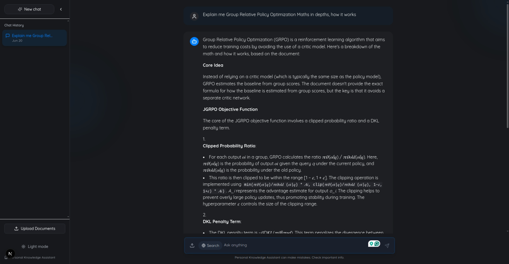
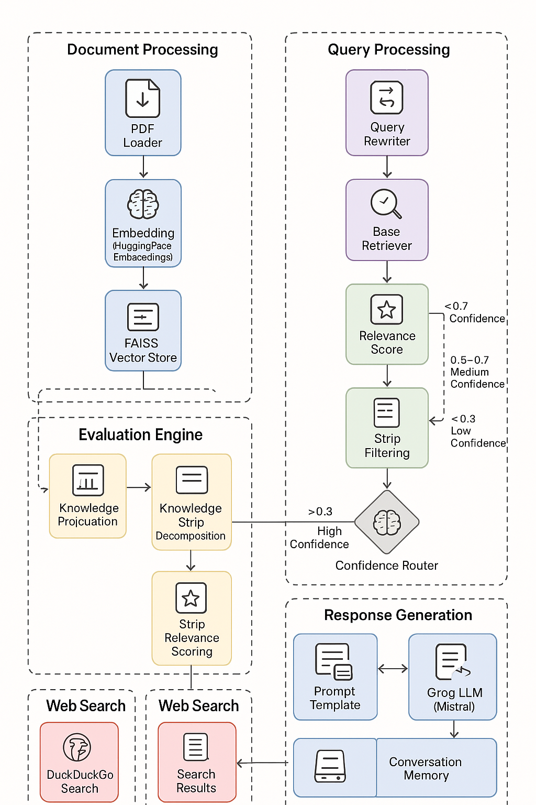

<div align="center">
  
  # 📚 Personal Knowledge Assistant

  
  
  <p align="center">
    <strong>An intelligent RAG-based platform for querying books and personal knowledge</strong>
  </p>
  
  <p align="center">
    <a href="#-features">Features</a> •
    <a href="#-quick-start">Quick Start</a> •
    <a href="#-system-architecture">Architecture</a> •
    <a href="#-backend-setup">Backend Setup</a> •
    <a href="#-frontend-setup">Frontend Setup</a> •
    <a href="#-usage">Usage</a> •
    <a href="#-contributing">Contributing</a>
  </p>
  
  <p align="center">
    
    
    
    
    
  </p>
</div>

---

## ✨ Features

- 🤖 **Intelligent Q&A**: Query your personal document collection using natural language
- 🧠 **Advanced RAG**: Confidence-based routing with knowledge strip decomposition
- 🔍 **Smart Search**: Automatic web search fallback for low-confidence queries
- 📄 **Multi-format Support**: PDF, TXT, MD, DOCX, and PPTX document ingestion
- 🎨 **Modern UI**: Beautiful, responsive chat interface with real-time math rendering
- ⚡ **Fast Retrieval**: FAISS vector store for lightning-fast document search
- 🌓 **Dark/Light Mode**: Seamless theme switching for better user experience

---

## 🚀 Quick Start

```bash
# Clone the repository
git clone https://github.com/your-username/personal-knowledge-assistant.git
cd personal-knowledge-assistant

# Backend setup
cd backend
python -m venv venv
source venv/bin/activate  # Windows: venv\Scripts\activate
pip install -r requirements.txt

# Add your Google API key to .env
echo "GOOGLE_API_KEY=your_key_here" > .env

# Ingest your documents
python ingest.py --dir your_books_directory

# Start backend
uvicorn app.main:app --reload --host 0.0.0.0 --port 8000

# Frontend setup (new terminal)
cd ../frontend
npm install
npm run dev
```

Open [http://localhost:3000](http://localhost:3000) to start using the application!

---

## 🏗️ System Architecture

<div align="center">
  
</div>

Our system employs a sophisticated multi-stage architecture designed for optimal knowledge retrieval and response generation:

### 🔄 Document Processing Pipeline

- **📖 Document Loading**: Processes PDF documents using PyPDFLoader
- **✂️ Text Chunking**: Splits documents into manageable chunks using RecursiveCharacterTextSplitter
- **🔗 Embedding Generation**: Converts chunks into vector representations using HuggingFaceEmbeddings
- **💾 Vector Storage**: Stores embeddings in a FAISS vector store for efficient retrieval

### 🔍 Query Processing Engine

- **🔧 Query Rewriting**: Rewrites the original query to be more effective for retrieval
- **📊 Base Retrieval**: Retrieves initial set of relevant documents from the vector store
- **🎯 Contextual Compression**: Applies filtering and extraction to improve retrieval quality

### 🎯 Confidence-Based Evaluation

- **📈 Document Evaluation**: Evaluates each retrieved document for relevance and reliability
- **🔢 Score Calculation**: Combines relevance and reliability into a confidence score
- **🛤️ Confidence Routing**: Routes the query to different processing paths based on confidence:
  - **🟢 High Confidence (>0.7)**: Uses direct knowledge refinement
  - **🟡 Medium Confidence (0.3-0.7)**: Uses hybrid approach
  - **🔴 Low Confidence (<0.3)**: Falls back to web search

### 🔬 Knowledge Refinement

- **🧩 Knowledge Strip Decomposition**: Breaks documents into individual "knowledge strips"
- **⭐ Strip Relevance Scoring**: Scores each strip's relevance to the query
- **🏷️ Strip Filtering**: Filters strips based on relevance threshold

### 🌐 Web Search Integration

- **🔎 Search Query Generation**: Creates optimized search queries for low confidence scenarios
- **🦆 DuckDuckGo Search**: Performs web search using DuckDuckGo API
- **⚡ Result Processing**: Extracts and processes relevant information from search results

### 🤖 Response Generation

- **📝 Prompt Template**: Assembles a prompt with context, confidence level, and query
- **💭 Conversation Memory**: Maintains chat history for contextual responses
- **🧠 LLM Generation**: Generates final response using Google Gemini 2.0 Flash model
- **✨ Response Formatting**: Formats response based on confidence level with appropriate caveats

### 🚀 Key Innovations

1. **🎯 Confidence-Based Routing**: Intelligently routes queries based on document relevance
2. **🧩 Knowledge Strip Decomposition**: Extracts and filters relevant information pieces
3. **🔄 Dynamic Web Search Fallback**: Uses web search when document knowledge is insufficient
4. **📊 Document Evaluation**: Explicitly evaluates document relevance and reliability
5. **🎯 Contextual Compression**: Uses embeddings filtering and LLM extraction to improve retrieval quality

---

## 📋 Prerequisites

<table>
<tr>
<td>

**🐍 Python 3.9+**
Backend development

</td>
<td>

**🟢 Node.js 18+**
Frontend development

</td>
<td>

**📚 PDF Documents**
Your knowledge base

</td>
</tr>
</table>

---

## 🔧 Backend Setup

### 1. 📁 Project Structure

Create and organize your project directory:

```bash
mkdir personal-knowledge-assistant
cd personal-knowledge-assistant
mkdir backend frontend
```

<details>
<summary>📂 <strong>View Complete Directory Structure</strong></summary>

```
backend/
├── app/
│   ├── main.py                 # FastAPI application entry point
│   ├── api/
│   │   ├── __init__.py
│   │   └── routes/
│   │       ├── __init__.py
│   │       ├── chat.py         # Chat endpoints
│   │       └── upload.py       # File upload endpoints
│   ├── core/
│   │   ├── __init__.py
│   │   ├── config.py          # Configuration settings
│   │   └── security.py        # Security utilities
│   ├── db/
│   │   ├── __init__.py
│   │   └── vector_store.py    # Vector database operations
│   ├── models/
│   │   ├── __init__.py
│   │   └── schemas.py         # Pydantic models
│   ├── services/
│   │   ├── __init__.py
│   │   ├── rag.py            # RAG implementation
│   │   └── llm.py            # LLM service
│   └── utils/
│       ├── __init__.py
│       └── text_processing.py # Text utilities
├── data/
│   └── vector_store/         # FAISS index storage
├── knowledge_base/           # Uploaded documents
├── ingest.py                # Document ingestion script
├── requirements.txt         # Python dependencies
└── .env                    # Environment variables
```

</details>

### 2. 🐍 Virtual Environment & Dependencies

```bash
cd backend
python -m venv venv

# Activate virtual environment
source venv/bin/activate  # Linux/macOS
# venv\Scripts\activate   # Windows
```

**📦 Install Dependencies:**

<details>
<summary>📋 <strong>requirements.txt</strong></summary>

```txt

```txt
fastapi>=0.104.1
uvicorn[standard]>=0.24.0
pydantic>=2.5.0
pydantic-settings>=2.1.0
langchain>=0.1.0
langchain-google-genai>=1.0.0
langchain-community>=0.0.13
langchain-huggingface>=0.0.1
faiss-cpu>=1.7.4
python-dotenv>=1.0.0
pypdf>=3.17.0
sentence-transformers>=2.2.2
python-multipart>=0.0.6
```

</details>

```bash
pip install -r requirements.txt
```

### 3. 🔑 Environment Configuration

Create a `.env` file in the backend directory:

```bash
# API Keys
GOOGLE_API_KEY=your_google_api_key_here

# Application Settings
ENVIRONMENT=development
DEBUG=true
HOST=0.0.0.0
PORT=8000

# Vector Store Settings
VECTOR_STORE_PATH=./data/vector_store
CHUNK_SIZE=1000
CHUNK_OVERLAP=200
TOP_K_RESULTS=5
```

> **🔗 Get your Google API key:**
> 1. Visit [Google AI Studio](https://makersuite.google.com/app/apikey)
> 2. Create a new API key
> 3. Copy and paste it in your `.env` file

### 4. 📁 Initialize Project Structure

```bash
# Create all necessary __init__.py files
touch app/__init__.py
touch app/api/__init__.py
touch app/api/routes/__init__.py
touch app/core/__init__.py
touch app/db/__init__.py
touch app/models/__init__.py
touch app/services/__init__.py
touch app/utils/__init__.py

# Create data directories
mkdir -p data/vector_store
mkdir -p knowledge_base
```

### 5. 📚 Document Ingestion

```bash
# Place your PDF documents in the knowledge_base directory
cp /path/to/your/books/*.pdf knowledge_base/

# Ingest documents into the vector store
python ingest.py --dir knowledge_base
```

### 6. 🚀 Start the Backend Server

```bash
```bash
uvicorn app.main:app --reload --host 0.0.0.0 --port 8000
```

> ✅ **Backend is ready!** Your API will be available at `http://localhost:8000`

---

## 🎨 Frontend Setup

### 1. 🆕 Initialize Next.js Project

```bash
cd ../frontend
npx create-next-app@latest . --typescript --eslint --tailwind --src-dir --app --import-alias="@/*"
```

### 2. 📦 Install Dependencies

```bash
# Core dependencies
npm install lucide-react react-markdown framer-motion next-themes

# Math rendering
npm install katex remark-math rehype-katex

# UI components
npm install @radix-ui/react-dialog @radix-ui/react-slot class-variance-authority clsx tailwind-merge

# Additional utilities
npm install uuid @types/uuid
```

### 3. 🎨 Setup shadcn/ui

```bash
npx shadcn-ui@latest init
```

**Configuration Options:**
- Style: `Default`
- Base Color: `Neutral`
- CSS variables: `Yes`

**Install UI Components:**
```bash
npx shadcn-ui@latest add button textarea card dialog alert
```

### 4. 🔧 Environment Configuration

Create `.env.local` in the frontend directory:

```bash
# API Configuration
NEXT_PUBLIC_API_URL=http://localhost:8000/api

# Application Settings
NEXT_PUBLIC_APP_NAME=Personal Knowledge Assistant
NEXT_PUBLIC_APP_DESCRIPTION=Intelligent RAG-based knowledge assistant
```

### 5. 🚀 Start Development Server

```bash
npm run dev
```

> ✅ **Frontend is ready!** Open [http://localhost:3000](http://localhost:3000) to view your application

---

## 🎯 Usage

### 📝 Basic Queries

1. **📖 Document Questions**: Ask questions about your uploaded documents
   ```
   "What are the main themes in the uploaded book?"
   "Explain the concept of neural networks from the documents"
   ```

2. **🔍 Specific Information**: Search for specific facts or details
   ```
   "What is the definition of machine learning?"
   "List the key algorithms mentioned in chapter 5"
   ```

3. **📊 Mathematical Concepts**: Get beautifully rendered mathematical explanations
   ```
   "Explain the backpropagation algorithm with equations"
   "What is the formula for gradient descent?"
   ```

### 🎨 Features in Action

- **🤖 Smart Responses**: Confidence-based answers with source attribution
- **🔍 Web Search Fallback**: Automatic web search for unknown topics
- **📊 Math Rendering**: Beautiful LaTeX equation rendering
- **🌓 Theme Support**: Toggle between light and dark modes
- **📱 Responsive Design**: Works seamlessly on all devices

---

## 🔧 Troubleshooting

<details>
<summary>🗂️ <strong>Vector Store Issues</strong></summary>

**Problem**: Vector store corruption or missing embeddings

**Solution**:
```bash
# Remove corrupted vector store
rm -rf data/vector_store

# Re-ingest documents
python ingest.py --dir knowledge_base
```

</details>

<details>
<summary>🔌 <strong>API Connection Issues</strong></summary>

**Problem**: Frontend can't connect to backend

**Solutions**:
1. Ensure backend is running on port 8000
2. Check CORS configuration in FastAPI
3. Verify `.env.local` has correct API URL
4. Check firewall settings

</details>

<details>
<summary>🔑 <strong>Authentication Errors</strong></summary>

**Problem**: Google API key issues

**Solutions**:
1. Verify API key in `.env` file
2. Check API key permissions
3. Ensure billing is enabled for Google AI
4. Test API key independently

</details>

---

## ⚙️ Customization

### 🧠 LLM Model Configuration

```python
# app/core/config.py
LLM_MODEL: str = "gemini-1.5-pro"  # Options: gemini-1.5-pro, gemini-1.5-flash
TEMPERATURE: float = 0.7
MAX_TOKENS: int = 2048
```

### 🔧 RAG Parameters

```python
# app/core/config.py
CHUNK_SIZE: int = 1000          # Increase for larger context
CHUNK_OVERLAP: int = 200        # Reduce information loss
TOP_K_RESULTS: int = 5          # More comprehensive results
CONFIDENCE_THRESHOLD: float = 0.7  # Adjust routing sensitivity
```

### 🎯 Embedding Model

```python
# app/core/config.py
EMBEDDING_MODEL: str = "sentence-transformers/all-MiniLM-L6-v2"
# Alternatives: "all-mpnet-base-v2", "all-roberta-large-v1"
```

---

## 🤝 Contributing

We welcome contributions! Here's how to get started:

### 🔧 Development Setup

1. **Fork the repository**
2. **Create a feature branch**
   ```bash
   git checkout -b feature/amazing-feature
   ```
3. **Make your changes**
4. **Run tests**
   ```bash
   # Backend tests
   cd backend && python -m pytest
   
   # Frontend tests
   cd frontend && npm test
   ```
5. **Submit a pull request**

### 📋 Guidelines

- Follow PEP 8 for Python code
- Use TypeScript for all new frontend code
- Add tests for new features
- Update documentation as needed
- Ensure all tests pass before submitting

---

## 📄 License

This project is licensed under the MIT License - see the [LICENSE](LICENSE) file for details.

---

## 🙏 Acknowledgments

- **🤗 Hugging Face** for embedding models
- **🔍 LangChain** for RAG framework
- **⚡ FastAPI** for the robust backend
- **⚛️ Next.js** for the amazing frontend
- **🎨 Tailwind CSS** for beautiful styling

---

<div align="center">
  <h3>Built with ❤️ by <a href="https://github.com/ahammadnafiz">Ahammad Nafiz</a></h3>
  
  <p>
    <a href="https://github.com/your-username/personal-knowledge-assistant">⭐ Star this project</a> •
    <a href="https://github.com/your-username/personal-knowledge-assistant/issues">🐛 Report Bug</a> •
    <a href="https://github.com/your-username/personal-knowledge-assistant/discussions">💬 Discussions</a>
  </p>
  
  
  
</div>
